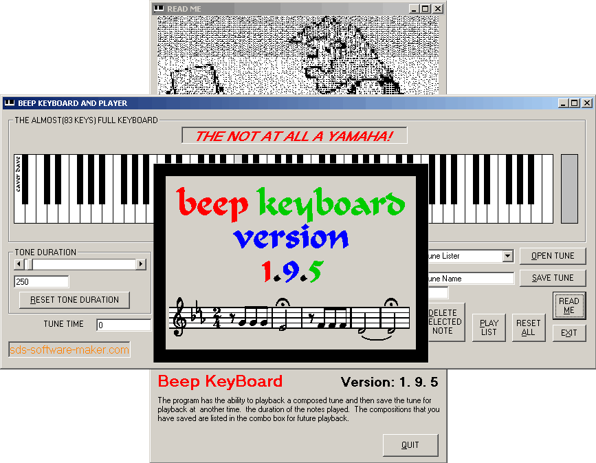



## BeepKeyBoard v 1\.9\.5

### Description

Title: - BeepKeyBoard v 1.9.5

Update: The compositions can now be edited ( a basic delete item) as you compose

The tune time can also be seen as you compose

Splash screen added

----

Update: Rearranged the key layout as in a true piano and added notation listing and file saving

----

Using the windows Kernel 32 beep lib to play a range of frequencies to simulate an 83 key piano keyboard.

----

Most PC speakers have a limited range of frequencies that they can reproduce this range is approximately 37 hz to 30,000 hz, which is why the key board has only 83 keys not the full 88

The program has the ability to playback a composed tune and then save the tune for playback at another time.

----

The program saves the composition as a matched triplet of files one of which saves the frequencies played, the other saves the duration of the notes played and the last of the files saves the played notes.

----

Pauses are notated as OOO

----

The compositions that you have saved are listed in the combo box for future playback.

Sample tune included
 
### More Info
 

             |
---                |---
**Submitted On**   |2007-04-30 23:44:36
**By**             |[caver dave](https://github.com/Planet-Source-Code/PSCIndex/blob/master/ByAuthor/caver-dave.md)
**Level**          |Intermediate
**User Rating**    |5.0 (20 globes from 4 users)
**Compatibility**  |VB 6\.0
**Category**       |[Sound/MP3](https://github.com/Planet-Source-Code/PSCIndex/blob/master/ByCategory/sound-mp3__1-45.md)
**World**          |[Visual Basic](https://github.com/Planet-Source-Code/PSCIndex/blob/master/ByWorld/visual-basic.md)
**Archive File**   |[BeepKeyBoa206320512007\.zip](https://github.com/Planet-Source-Code/caver-dave-beepkeyboard-v-1-9-5__1-68435/archive/master.zip)

### API Declarations

see code

